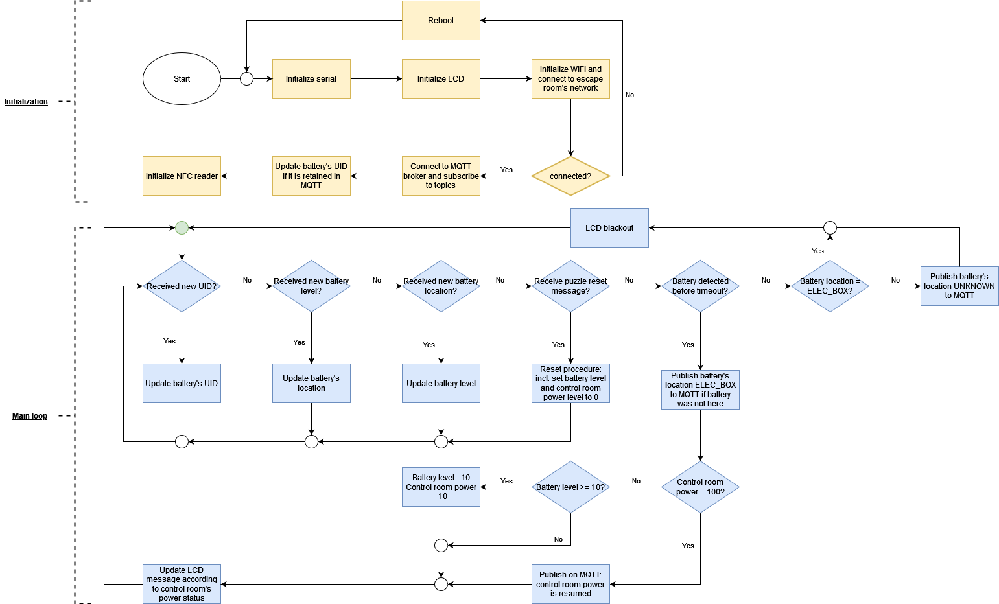

# Battery Dock

This folder contain the source files regarding the battery dock, which is the device to be placed in the electric box. Once a fully charged battery is placed on it, the power of the control room shall be resumed.

## Flowchart

