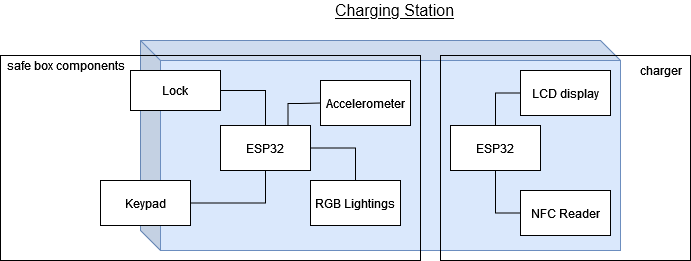

# Puzzle-5
The puzzle is a part of the Ubiquitous Lab course WS 21/22. The puzzle will be integrated in the escape room which is modelled as a control room of a power station in the future (~2050).

This page shows the latest puzzle overview. For previous ideas build-up, please check `/docs/Presentations`.

For progress updates, please check `/docs/Minutes`.

## Story Overview
A Solar storm hits the city which causes a power outage at a massive scale. A group of interns/visitors are struck in the control room. They have to solve a series of puzzles in order to fix the power supply and to get out of the power station eventually.
## The Puzzle
The objective of this puzzle is to recharge a super nuclear battery and reinstall it into the electric box in order to resume the power of the control room.

Initially the battery is inside the electric box but the battery is discharged due to the sudden power outage. The nuclear battery charger is also inside the control room. It is being locked in a box for safety reason.

Next to the station is a small toy called HoloCube, which was built by the control room's staff as a interesting way to unlock the charger box in case the box's password is forgotten. The cube has the game 2048 loaded into it. (If you don't know about 2048, you can have a try [here](https://2048game.com/)).

Thanks to the advanced technology, the battery is operated in fully wireless. It only need to be placed on the platform for a couple of seconds until full charged. Then place it back to the electric box to supply the power for the control room.

The general flow of the puzzle is as shown below:

## Hardware

### HoloCube

The HoloCube is a transparent display, where the emitting light is guided through a prism cube. The controller of the display is **ESP32-PICO-D4** and an **IMU (MPU-9250)** is used as the human-machine-interface (HMI).

Because of the controller, the HoloCube has wireless connectivity and it can command the charger box to unlock.

The proposed model of HoloCube for the puzzle is showcased below:

### Charger box

The charger box is a wooden box locked by a mechanical lock. Inside the box is the wireless charging platform, which is technically a NFC reader. A LCD/LED will act as an indicator to show the battery level when the reader detects the battery. There is also LED lightings inside the box to prompt players to close the box after recharge.

Current outlook of the box:

### Battery

Technically, the battery is simply a small plastic box with a NFC sticker at the bottom. No power is required for this portable item.

### Electric Box

The main component of the electric box is a NFC reader with battery level indicator enclosed in a plastic box, which is similar to the platform inside the charger box.

The cupboard in the control room is decided to be the electric box. The decorations required are to be discussed.

### Connection Diagram

